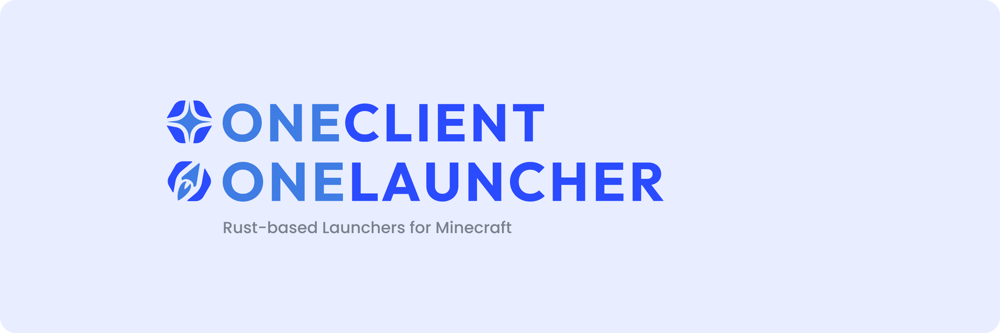

<div align="center">



# OneLauncher  |  OneClient
The monorepo containing the code for OneLauncher, OneClient, and their core backend.

OneClient is a Minecraft client featuring fully 100% open-source components, offering many packaged and pre-configured mods in one click.
OneLauncher is a WIP Minecraft launcher giving power-users the greatest customization whilst featuring a clean UI.

</div>

> [!NOTE]
> This is **OneLauncher/OneClient v2** — a full rewrite in Rust using [Freya](https://freyaui.dev/).
> All previous web-based (React / Tauri) code has been removed.

## Technologies Used
- [**Rust**](https://www.rust-lang.org/) (edition 2024)
- [**Freya**](https://freyaui.dev/) - native GUI framework for Rust

## Contributing
We welcome contributions! Please read our [contributing guidelines](CONTRIBUTING.md) before getting started.

### Requirements

The project targets **Rust edition 2024**, so a recent Rust toolchain is required.

- Install Rust via [rustup](https://rustup.rs/)
- Use a toolchain that supports edition 2024 (`rustc` **1.85+**)

### Building & Running

```sh
# Run the app
cargo run -p oneclient_app

# Build a release binary
cargo build --release -p oneclient_app
```

### Packaging / Releasing

Installers are produced with [**cargo-packager**](https://github.com/crabnebula-dev/cargo-packager)
(the standalone bundler spun out of the Tauri bundler). Config lives in
[`packages/oneclient_app/Cargo.toml`](./packages/oneclient_app/Cargo.toml) under
`[package.metadata.packager]`.

```sh
cargo install cargo-packager --locked

# Build the binary, then bundle it for the current OS:
cargo build --release -p oneclient_app
cargo packager --release -p oneclient_app --formats <targets>
#   Windows: nsis      macOS: app,dmg      Linux: deb,appimage
```

### Versioning

The workspace shares a single version, defined in the root [`Cargo.toml`](./Cargo.toml)
under `[workspace.package]`. Current version: **2.0.0**.

### Project Structure

All crates live under **`packages/`** in a single Cargo workspace.

- [**`oneclient_app/`**](./packages/oneclient_app/) - The Freya desktop application (UI, routes, entry point).
- [**`oneclient_core/`**](./packages/oneclient_core/) - Launcher core. Contains the entire launcher logic.
- [**`oneclient_db/`**](./packages/oneclient_db/) - SQLx-based database layer.
- [**`oneclient_macro/`**](./packages/oneclient_macro/) - Macro definitions to simplify some code.
- [**`polyio/`**](./packages/polyio/) - PolyIO-rs. Shared IO utilities (archives, files, system helpers).

## Code signing

This program uses free code signing provided by [SignPath.io](https://signpath.io?utm_source=foundation&utm_medium=github&utm_campaign=0install), and a certificate by the [SignPath Foundation](https://signpath.org?utm_source=foundation&utm_medium=github&utm_campaign=0install). We thank them very much to their contributions to OSS software!
