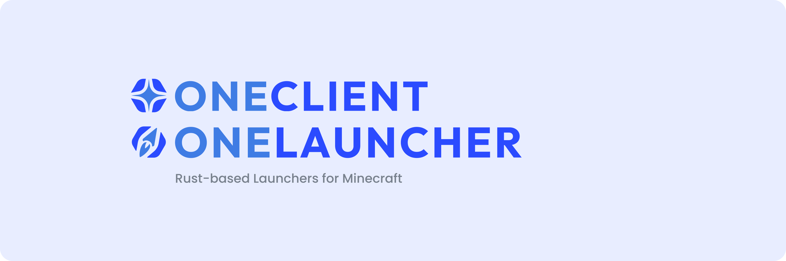

<div align="center">



# OneClient  |  OneLauncher
The monorepo containing the code for OneLauncher, OneClient, and their core backend.

OneClient is a Minecraft client featuring fully 100% open-source components, offering many packaged and pre-configured mods in one click.
OneLauncher is a WIP Minecraft launcher giving power-users the greatest customization whilst featuring a clean UI.

</div>

## Installing

You can install the latest release of OneClient from our website: [https://polyfrost.org/projects/oneclient](https://polyfrost.org/projects/oneclient)
as well as our [GitHub releases](https://github.com/Polyfrost/OneLauncher/releases/latest).

| Windows (x86_64) | macOS (Intel & Apple Silicon) | Linux (x86_64)                                          |
|------------------|-------------------------------|---------------------------------------------------------|
| Installer 🔄      | DMG 🔄                        | AppImage 🔄                                             |
|                  | App Bundle 🔄                 | DEB                                                     |
|                  |                               | RPM                                                     |
|                  |                               | [AUR](https://aur.archlinux.org/packages/oneclient-bin) |

> 🔄 = Has support for autoupdating built-in


## Contributing

We welcome contributions! Please read our [contributing guidelines](CONTRIBUTING.md) before getting started.


### Requirements

The project targets **Rust 1.97** or later. You can install Rust via [rustup](https://rustup.rs/).


### Building & Running

```sh
# Run the app
cargo run -p oneclient_app

# Build a release binary
cargo build -p oneclient_app --release
```


### Packaging / Releasing

Installers are produced with [**cargo-packager**](https://github.com/crabnebula-dev/cargo-packager)
(the standalone bundler spun out of the Tauri bundler). Config lives in
[`packages/oneclient_app/Cargo.toml`](./packages/oneclient_app/Cargo.toml) under
`[package.metadata.packager]`.

```sh
cargo install cargo-packager --locked

# Build the binary, then bundle it for the current OS:
cargo build --release -p oneclient_app
cargo packager --release -p oneclient_app --formats <targets>
#   Windows: nsis      macOS: app,dmg      Linux: deb,appimage
```


### Versioning

The workspace shares a single version, defined in the root [`Cargo.toml`](./Cargo.toml) under `[workspace.package]`.


## Code signing

This program uses free code signing provided by [SignPath.io](https://signpath.io?utm_source=foundation&utm_medium=github&utm_campaign=0install), and a certificate by the [SignPath Foundation](https://signpath.org?utm_source=foundation&utm_medium=github&utm_campaign=0install). We thank them very much to their contributions to OSS software!
